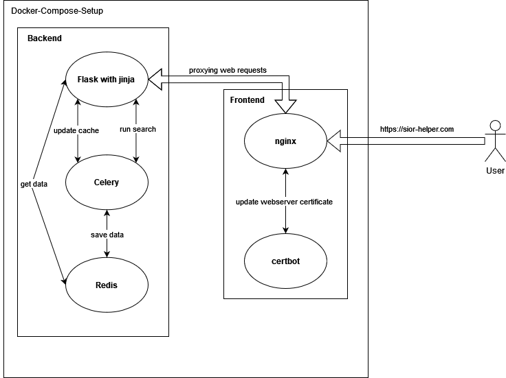

# sior-helper
This dashboard helps you create, verify, and review your SIEM and SOAR configurations by providing information on detections, responses, and tests for specific groups and/or keywords.
You can find the sior-helper [here](https://sior-helper.com/dashboard)

## Parts 

This image does not show the mysql components

## Deployment
To deploy the sior-helper you need to make sure to create a .env-file with the following attributes
# .env file
- DOCKER_BUILDKIT -> should be 1
- APP_SECRET_KEY -> secret key
- SECURITY_PASSWORD_SALT -> Salt for security
- REDIS_PASSWORD -> Redis password
- CELERY_BROKER_URL -> Redis broker url for celery. Should look like this: redis://:<REDIS_PASSWORD>@redis:6379/0
- CELERY_RESULT_BACKEND -> Redis backend url for celery. Should look like this: redis://:<REDIS_PASSWORD>@redis:6379/0
- MYSQL_DATABASE -> Name for mysql user database
- MYSQL_USER -> username for mysql user database
- MYSQL_PASSWORD -> password for mysql user database
- MYSQL_ROOT_PASSWORD -> Root password for mysql user database
- RECAPTCHA_PUBLIC_KEY -> Google reCAPTCHA, Version 2 
- RECAPTCHA_PRIVATE_KEY -> Google reCAPTCHA, Version 2 
- SENDGRID_API_KEY -> using sendgrid to send email for confirmation
- SENDGRID_FROM_EMAIL -> sender email address from where sendgrid sends the confirmation email

If you want to use the nginx part, you will need to create your own nginx.conf file.
If you don't need it, you should remove the nginx service from docker-compose.yml.
